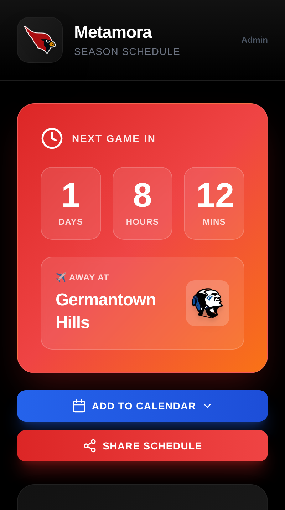
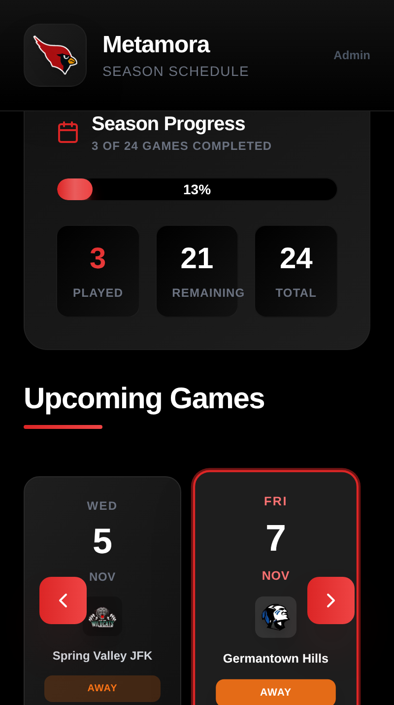
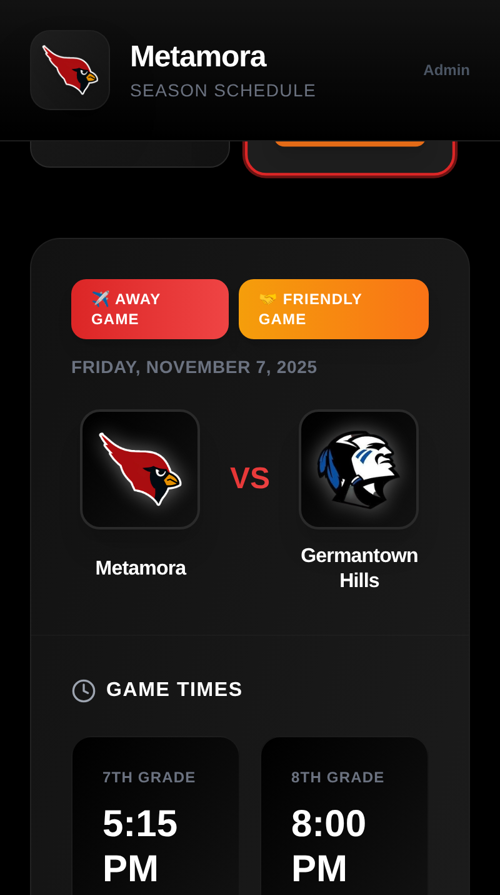
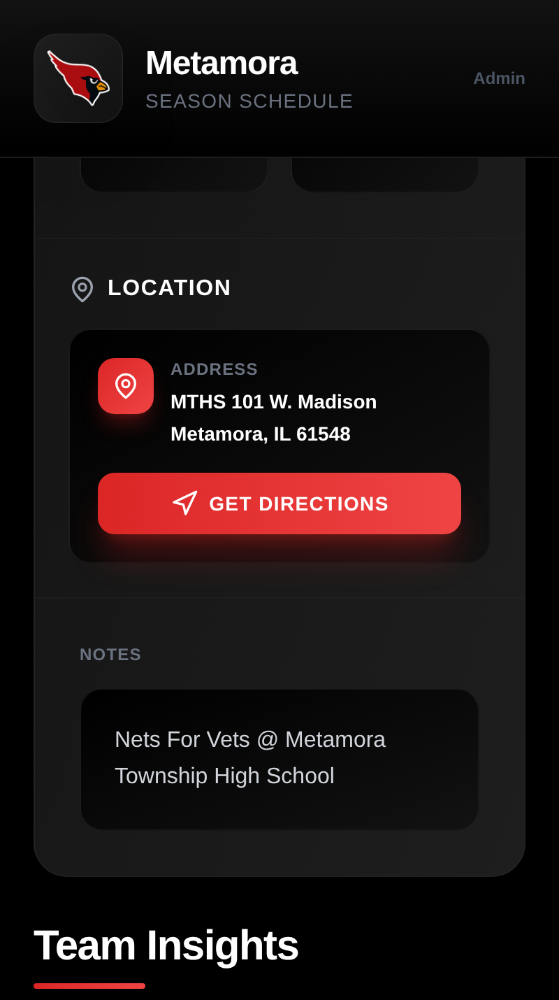
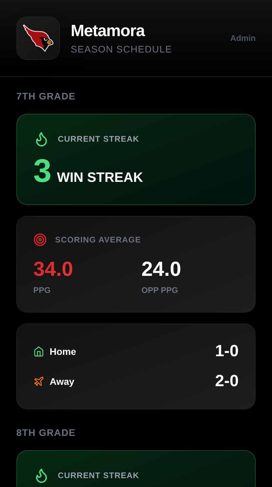
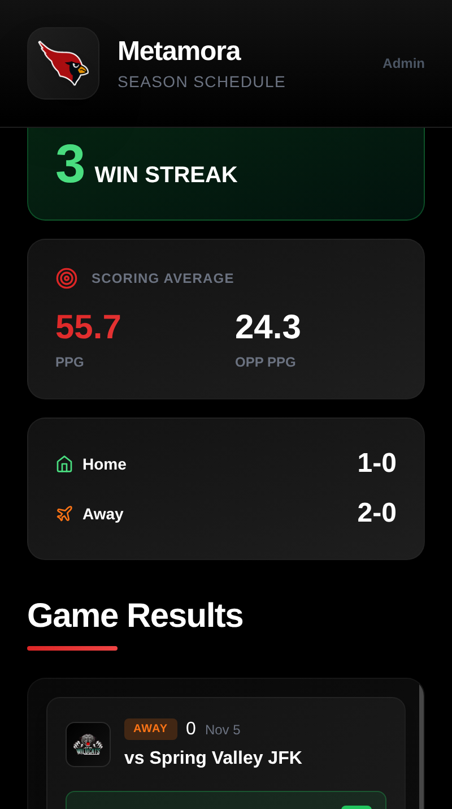
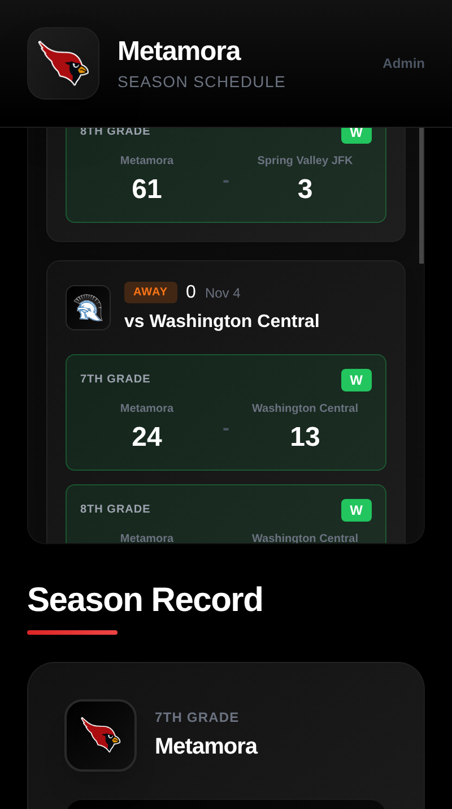
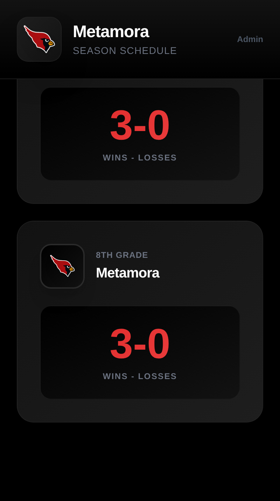

# Basketball Team Tracker

A modern, mobile-first web application for tracking junior high basketball team schedules, scores, and season stats. Built with React, Express, and SQLite, containerized with Docker for easy deployment on your Ubuntu server.

## Screenshots

<div align="center">

### 📱 Game Countdown & Quick Actions


*Live countdown to next game with Add to Calendar and Share Schedule features*

---

### 📊 Season Progress & Schedule Calendar


*Track season completion and browse games with horizontal scrollable calendar*

---

### 🏀 Game Details & Times


*View matchup details with separate game times for 7th and 8th grade teams*

---

### 📍 Location & Navigation


*Get directions to game locations with one tap - opens native maps app*

---

### 📈 Team Insights & Analytics


*View win streaks, scoring averages, and home/away splits for each grade*

---

### 🎯 Game Results Feed


*Scrollable feed of completed games with scores and win/loss indicators*

---

### 🏆 Individual Game Scores


*Detailed score breakdowns by grade with win/loss badges*

---

### 📋 Season Record Overview


*Overall win-loss records for both 7th and 8th grade teams*

</div>

## Features

### Public Frontend (No Login Required)
- 📱 **Mobile-optimized** dark-themed interface
- 📅 **Interactive calendar** with swipeable game cards and auto-center on current game
- 🏀 **Game details** including teams, times (7th & 8th grade), and locations
- 🗺️ **Smart maps integration** - automatically opens Google Maps (Android) or Apple Maps (iOS)
- 🏆 **Season stats** displaying win-loss records for both grades
- 📊 **Team insights** with win streaks, scoring averages, and home/away splits
- 🎯 **Scrollable game results** feed showing all completed games
- ⚡ **Live countdown** to next game with real-time updates
- 📆 **Add to Calendar** - Export schedule to Google Calendar, Apple Calendar, Outlook, or Android
- 🔗 **Share schedule** - Quick link sharing to family and friends

### Admin Backend (Password Protected)
- 🔐 **Simple password authentication** (configured via docker-compose.yml)
- ➕ **Create, edit, and delete** game events
- 🏠 **Home/Away** game designation
- ⏰ **Separate start times** for 7th and 8th grade games (or N/A)
- 📊 **Score tracking** after games are completed
- 🤝 **Non-conference/Friendly game** toggle - track scores without affecting season stats
- 🖼️ **Logo uploads** for both home team and opponents
- 📍 **Location management** for home and away games
- 📝 **Notes field** for additional game information
- 💾 **Backup & restore** functionality for data management

## Quick Start

### Prerequisites
- Docker and Docker Compose installed on your Ubuntu server

### Installation

1. **Clone or copy the project** to your server:
```bash
cd /path/to/basketball-tracker
```

2. **Configure settings** in `docker-compose.yml`:
```yaml
environment:
  - ADMIN_PASSWORD=your_secure_password  # Change this!
  - NODE_ENV=production
ports:
  - "8075:3000"  # Change port if needed
```

3. **Start the application**:
```bash
docker-compose up -d
```

4. **Access the application**:
   - Public schedule: `http://your-server-ip:8075`
   - Admin login: `http://your-server-ip:8075/admin/login`

### First Time Setup

1. Navigate to the admin login page
2. Enter your admin password (from docker-compose.yml)
3. Go to **Settings** tab to configure:
   - Home team name
   - Home team logo
   - Home gym location
4. Switch to **Events** tab and click **Add Event** to create your first game

## Usage Guide

### Adding a Game Event

1. Click **Add Event** in the admin dashboard
2. Fill in the required information:
   - **Date**: Game date
   - **Opponent Name**: Name of the opposing team
   - **Opponent Logo**: Upload their team logo (optional)
   - **Home/Away**: Select game location type
   - **Away Location**: If away, enter the full address
   - **7th Grade Time**: Start time or leave empty for N/A
   - **8th Grade Time**: Start time or leave empty for N/A
   - **Notes**: Any additional information
3. Click **Create Event**

### Adding Game Scores

1. After a game is completed, click **Edit** on the event
2. Scroll to the **Game Scores** section
3. Enter scores for each grade:
   - Home team score
   - Away team score
4. Click **Update Event**

The season stats will automatically update based on the scores!

### Public Access

Share `http://your-server-ip:8075` with family and friends. They can:
- Browse upcoming games in the calendar
- Click on a game to see full details
- Tap "Get Directions" to open the location in their maps app
- View season records for both grades

## Technical Details

### Tech Stack
- **Frontend**: React 18, TailwindCSS, React Router, Leaflet.js
- **Backend**: Node.js, Express, better-sqlite3
- **Database**: SQLite (file-based, persisted in `./data` volume)
- **Icons**: Lucide React
- **Deployment**: Docker & Docker Compose

### Project Structure
```
basketball-tracker/
├── backend/
│   ├── server.js          # Express server
│   ├── database.js        # SQLite database logic
│   └── package.json
├── frontend/
│   ├── src/
│   │   ├── components/    # React components
│   │   ├── App.jsx
│   │   └── main.jsx
│   └── package.json
├── data/                  # SQLite database (created on first run)
├── docker-compose.yml
├── Dockerfile
└── README.md
```

### Data Persistence

All data is persisted in Docker volumes, making it easy to backup and transfer between servers:

- **Database**: `./data/basketball-tracker.db` - All events, scores, and settings
- **Uploads**: `./uploads/` - Team logos and opponent logos

To backup everything:
```bash
# Backup database
cp data/basketball-tracker.db data/backup-$(date +%Y%m%d).db

# Backup entire data directory with uploads
tar -czf basketball-backup-$(date +%Y%m%d).tar.gz data uploads
```

To transfer to another server:
```bash
# On old server
tar -czf basketball-backup.tar.gz data uploads docker-compose.yml

# On new server
tar -xzf basketball-backup.tar.gz
docker-compose up -d
```

## Configuration

### Changing the Port

Edit `docker-compose.yml`:
```yaml
ports:
  - "8080:3000"  # Change 8080 to your desired port
```

Then restart:
```bash
docker-compose down
docker-compose up -d
```

### Changing Admin Password

1. Edit `docker-compose.yml`
2. Change the `ADMIN_PASSWORD` value
3. Restart the container:
```bash
docker-compose restart
```

## Maintenance

### View Logs
```bash
docker-compose logs -f
```

### Stop the Application
```bash
docker-compose down
```

### Update the Application
```bash
docker-compose down
docker-compose build --no-cache
docker-compose up -d
```

### Reset All Data
```bash
docker-compose down
rm -rf data
docker-compose up -d
```

## Mobile Experience

The application is specifically designed for mobile devices:
- Touch-optimized interface
- Swipeable calendar view
- Large, easy-to-tap buttons
- Responsive layout adapts to all screen sizes
- Platform-specific map integration (iOS/Android)

## Support

For issues or questions about the application, check:
- Server logs: `docker-compose logs`
- Make sure port 8075 is accessible (firewall rules)
- Verify Docker and Docker Compose are running

## License

This project is provided as-is for personal use.
